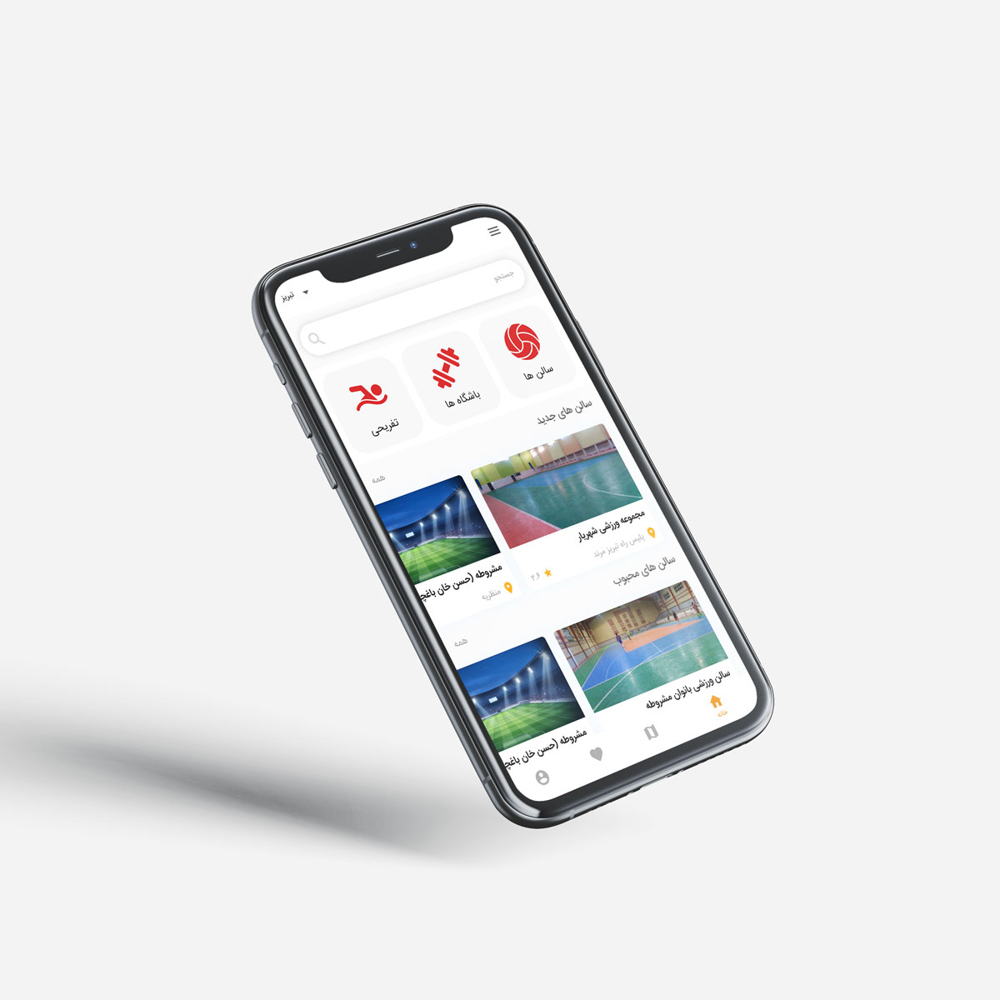

## About this project (Tapsalon)

This project is written with Laravel and Vuejs. It is an API and dashboard for a mobile app that introducing sport halls, gyms and other sport related facilities to those who install Tapsalon android app. 

Featres: 

- Ability to filter sport facilities based on city, sport facilities type, fee range, sports, ... 
- Information about each sport facilitiy like image, address and contact info.
- Ability to add comments and like the facilitiy.
- Ability to read multiple sport related articles. 
- Ability to enter a new or edit a sport facility from dashboard. 
- Ability to add multiple new sports, regions, and city. 
- Give a statistics about number of sport facilities and users. 

This repo is created as showcase. 

